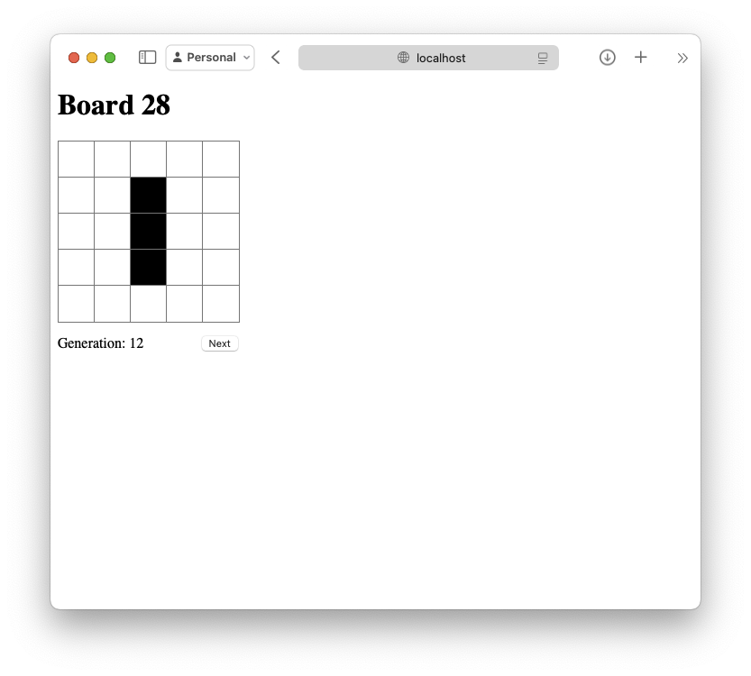
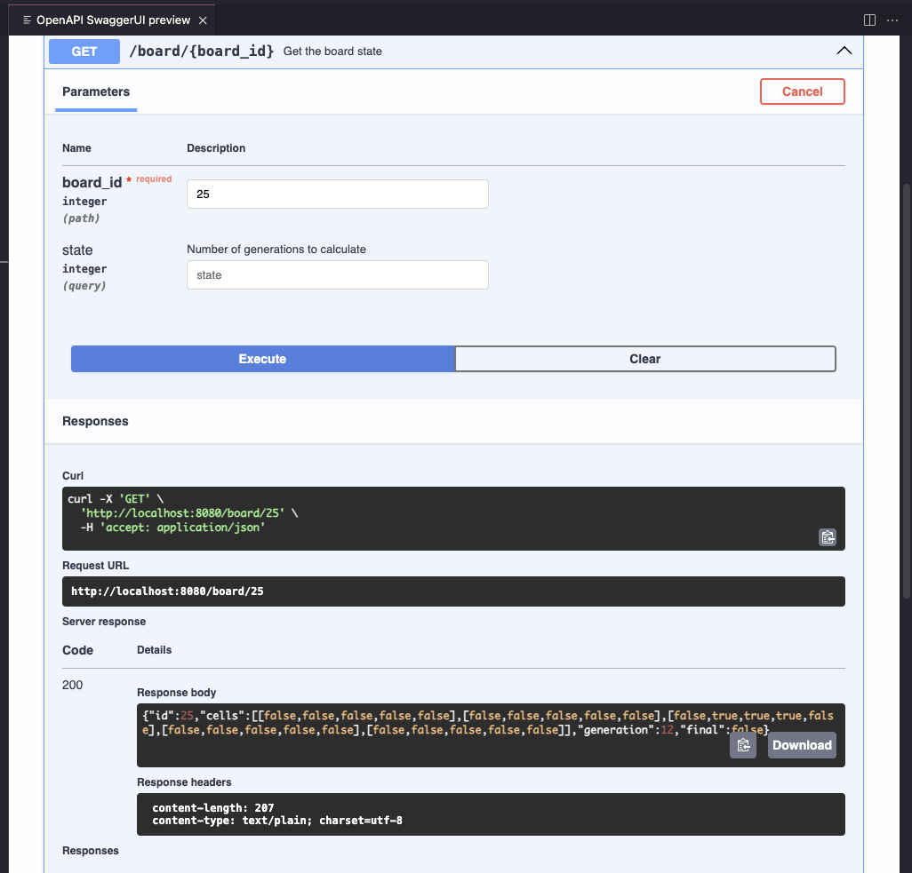

# conways-api-go

A REST API for Conway's Game of Life.

## Requirements

- Go: [download](https://go.dev/dl/)
- Air (optional live reload): [installation](https://github.com/air-verse/air/tree/master?tab=readme-ov-file#via-go-install-recommended)
- Templ (board web view): [installation](https://templ.guide/quick-start/installation#go-install)

## Using the Project

### Setup environment

#### Download modules

```sh
go mod download
```

#### Generate templ template

The [html template](#web-interface) needs to be generated the first time, or if [page.templ](/web/page.templ) is edited.

```sh
templ generate
```

#### Run the server

The entrypoint for the program is in [cmd/cmd.go](/cmd/cmd.go)

We can start the server with live reload for local development

```sh
air
```

or, run the command directly

```sh
go run cmd/cmd.go
```

or, compile the binary and run it

```sh
go build -o life-server ./cmd
./life-server
```

### Consume the API

The [OpenAPI spec file](/openapi.yml) details the API endpoints and their expected payloads and outputs.

#### Create a board

To create a new board:

```sh
curl --request POST \
  --url http://localhost:8080/board \
  --data '{
    "cells": [
      [false, false, false, false, false],
      [false, false, false, false, false],
      [false, true, true, true, false],
      [false, false, false, false, false],
      [false, false, false, false, false]
    ]
  }'
```

response:

```json
{ "id": 28 }
```

#### Fetch a board

With the returned `id`, you can now get the current state of the board:

```sh
curl --request GET \
  --url 'http://localhost:8080/board/{id}'
```

response:

```json
{
  "id": 28,
  "cells": [
    [false, false, false, false, false],
    [false, false, false, false, false],
    [false, true, true, true, false],
    [false, false, false, false, false],
    [false, false, false, false, false]
  ],
  "generation": 0,
  "final": false
}
```

#### Fetch a board, advancing its generations

You can also fetch a board, first advancing its generations one or more times:

```sh
curl --request GET \
  --url 'http://localhost:8080/board/{id}?state=10'
```

> state will default to a maximum value of 1000 if exceeded

response:

```json
{
  "id": 28,
  "cells": [
    [false, false, false, false, false],
    [false, false, false, false, false],
    [false, true, true, true, false],
    [false, false, false, false, false],
    [false, false, false, false, false]
  ],
  "generation": 10,
  "final": false
}
```

#### Fetch a board's final state

Fetching a board's final state, potentially getting an error if final state not reached in the request number of iterations

```sh
curl --request GET \
  --url 'http://localhost:8080/board/{id}/final?state=10'
```

response:

```json
{
  "id": 27,
  "cells": [
    [false, false, false, false, false],
    [false, false, false, false, false],
    [false, false, false, false, false],
    [false, false, false, false, false],
    [false, false, false, false, false]
  ],
  "generation": 14,
  "final": true
}
```

or

```json
{
  "error": "final state not reached"
}
```

### Web Interface

For convenience in visualizing output, you can also access the GET endpoints via a browser. The resulting page will have a display of the Game of Life grid and a button to advance a generation.



> The `Next` button will disable if the board is at its final generation.

CORS is allowed on this server, so you can also use VS Code's built-in OpenAPI Editor to make requests.



### Testing

Run at project root:

```sh
go test ./...
```

## About the Project

This was built as a solution to a tech challenge with roughly the following criteria:

1. Create an API for Conway's Game of Life
2. Allow for the following
   1. Upload a new board, return its id
   2. Get next state for a board
   3. Get x number of states forward for a board
   4. Get final state for a board
3. Server should retain state on restart

This project is built to demonstrate production-ready code, with some tradeoffs or exclusions to keep things reasonable for time and complexity. Otherwise, its structure and design are consistent with how I build HTTP servers in Go.

### Considerations

#### Language

This was built in Go because it is what I am most proficient in for building a backend/server. It is very well suited for this type of work, with a standard library that has more than enough included.

Non-standard library use of templ and testify are useful to eliminate a lot of boilerplate to be able to quickly give a visual aid and make test assertions. Bolt was used to support data persistence.

#### Data Persistence

To satisfy this need, I wanted to use something as simple as possible, since the data model is very basic. I went with [Bolt](https://github.com/etcd-io/bbolt) so that I didn't have to stand up any containers or outside services.

Since it's just another Go dependency in the code, nothing more is required to install to get it working. This is also super helpful for easy testing.

#### Testing

Testing is done by running integration tests against the server as an outside HTTP client. The table of tests will look a lot like unit tests, and the goal is to test each happy path and possible error that could be returned by the server from the perspective of an HTTP client, our intended user. By testing by making calls 'over the wire', we're not excluding any part of our stack and can test in an environment that is nearly identical to a real world production environment.

A few tests are provided to show how it is done, the test cases are not exhaustive. Specifically, tests around the happy path for creating and getting boards exist. Further tests would check things like input validation responses.
